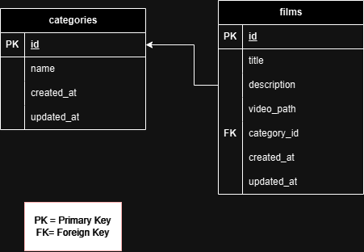

# API Streaming Film

Aplikasi sederhana untuk layanan streaming film menggunakan Laravel 9. Aplikasi ini menyediakan API dan antarmuka frontend untuk menampilkan daftar film, filter kategori, pencarian, dan pemutar video.

## Fitur
1. List kategori film.
2. List film dengan fitur pencarian dan filter berdasarkan kategori.
3. Detail film lengkap dengan deskripsi dan pemutar video.

## Persyaratan
- PHP >= 8.1
- Composer
- MySQL
- Web server seperti XAMPP

## Instalasi
1. Clone repository ini:
   ```bash
   git clone https://github.com/rijalulakhri-code/API_Film
   cd API_Film
2. Instal Dependensi
Pastikan Anda berada di direktori proyek, lalu jalankan perintah:
   ``` bash
   composer install
3. Konfigurasi File Environment
Salin file .env.example menjadi .env dan sesuaikan konfigurasi database serta pengaturan lainnya:

        cp .env.example .env
        
    ``` bash
        Edit file .env sesuai kebutuhan, seperti berikut:
        DB_CONNECTION=mysql
        DB_HOST=127.0.0.1
        DB_PORT=3306
        DB_DATABASE=api_film
        DB_USERNAME=root
        DB_PASSWORD=
4. Generate Application Key
Jalankan perintah untuk membuat application key:
    ``` bash
    php artisan key:generate
5. Migrasi dan Seeder
Jalankan perintah berikut untuk membuat tabel di database dan mengisi data awal:
    ``` bash
    php artisan migrate
    php artisan db:seed
6. Menjalankan Server
Jalankan perintah berikut untuk memulai server aplikasi:
    ``` bash
    php artisan serve

## ERD



